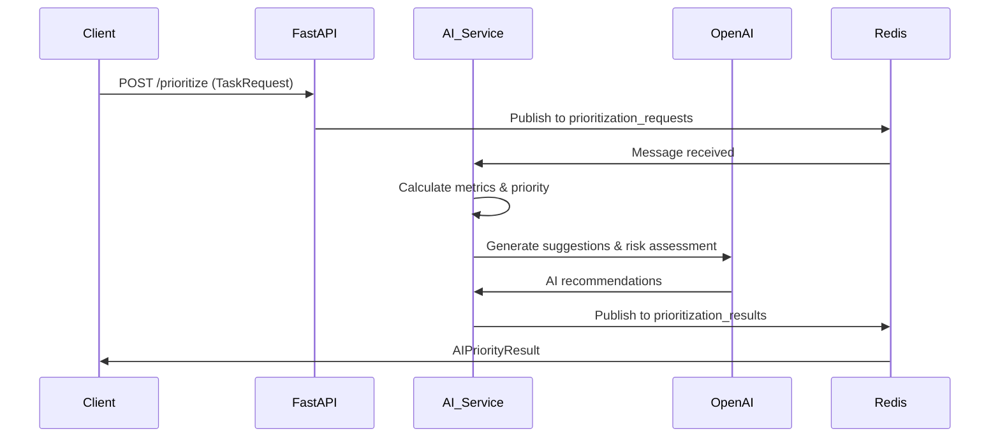

# 🧠 Enhanced AI Prioritization Engine v2.0

An intelligent, event-driven microservice for **automated task prioritization** using advanced AI models, mathematical scoring, and comprehensive business logic. **Now featuring NATS JetStream for enterprise-grade messaging, enhanced privacy protection, and automatic metric calculation** - no more manual input required!

## 🏗️ Architecture Overview

The AI Prioritization Engine follows a robust event-driven architecture with these core components:

### 🎭 Event Orchestrator
- Central coordinator for all AI processing
- Handles NATS event subscriptions
- Manages task analysis workflow
- Reports system metrics and health

### 🤖 Local AI Analyzer
- Privacy-first task content analysis
- Priority score calculation
- Business value assessment
- Effort estimation

### 🔒 Privacy Service
- GDPR-compliant processing
- Sensitive content detection
- Automatic AI bypass
- Privacy-safe event metadata

## 🚀 Key Features

### 🤖 **Automatic Metric Calculation** (NEW!)
- **Zero Manual Input**: Metrics are automatically calculated from task descriptions
- **AI-Powered Analysis**: Advanced content analysis determines business value, risk level, and effort estimates
- **GDPR Compliant**: Sensitive data stays local with manual fallback processing
- **80% Less User Input**: Users only need to provide basic task information

### Advanced AI-Powered Prioritization
- **Mathematical Scoring Model**: Multi-factor priority calculation with weighted metrics
- **Role-Based Authority**: Executive roles (CEO, CFO, CTO) receive higher priority weights
- **Time Sensitivity Analysis**: Automatic urgency calculation based on meeting times and deadlines
- **Category Multipliers**: Security incidents, infrastructure issues prioritized higher
- **Business Impact Assessment**: Considers affected user count and business value

### Intelligent Suggestions & Automation
- **AI-Generated User Suggestions**: Contextual self-help solutions using OpenAI GPT-3.5
- **Automated Workarounds**: Proactive solution recommendations
- **Escalation Logic**: Smart escalation for critical issues and high-authority users
- **Risk Assessment**: AI-powered risk analysis with mitigation strategies
- **SLA Recommendations**: Dynamic SLA calculation based on urgency and category

### Enterprise Event-Driven Architecture
- **NATS JetStream**: Primary event stream with at-least-once delivery and persistence
- **Redis Cache**: Enhanced caching for performance optimization and rate limiting
- **Dual Messaging**: NATS for events, Redis for caching and performance
- **Scalable Design**: Handle millions of concurrent prioritization requests
- **Real-time Processing**: Immediate priority assessment and routing with caching
- **Health Monitoring**: Comprehensive service health checks for both NATS and Redis

## 📊 Priority Calculation Model

The enhanced AI model uses a sophisticated weighted scoring system:

```
Final Priority Score = 
  (Urgency Score × 0.30) +
  (Business Impact × 0.25) +
  (Risk Score × 0.20) +
  (Role Weight × 0.15) +
  (Time Sensitivity × 0.10)
```

### Role Priority Weights
- **CEO**: 5.0 (Highest)
- **CFO/CTO**: 4.5
- **Manager**: 3.5
- **IT Admin**: 3.0
- **Client**: 2.5
- **Developer**: 2.5
- **Employee**: 2.0

### Category Urgency Multipliers
- **Security**: 1.5× (Highest urgency)
- **Infrastructure**: 1.3×
- **Meeting Prep**: 1.2×
- **Support**: 1.0× (Baseline)
- **Development**: 0.8×
- **Maintenance**: 0.7×
- **Training**: 0.6×
- **Compliance**: 0.9×

## 🏗️ Architecture

### New NATS + Redis Architecture

```
┌─────────────────┐    ┌─────────────────┐    ┌─────────────────┐
│   Client App    │    │  FastAPI Service │    │   OpenAI API    │
│                 │───▶│                 │───▶│                 │
│ Task Submission │    │ AI Prioritization│    │ Smart Suggestions│
└─────────────────┘    └─────────────────┘    └─────────────────┘
                                │
                                ▼
                       ┌─────────────────┐    ┌─────────────────┐
                       │ NATS JetStream  │    │   Redis Cache   │
                       │                 │    │                 │
                       │ Event Streaming │◄──▶│ Performance &   │
                       │ At-Least-Once   │    │ Rate Limiting   │
                       │ Persistence     │    │                 │
                       └─────────────────┘    └─────────────────┘
```

**Event Flow:**
1. **Request**: Client submits task → FastAPI → NATS JetStream
2. **Processing**: Background worker processes from NATS → AI Analysis
3. **Caching**: Results cached to Redis for performance 
4. **Response**: Results published to NATS result stream
5. **Retrieval**: Client polls or subscribes for results

### Key Components
- **NATS JetStream**: Primary event stream with guaranteed delivery
- **Redis**: High-performance caching and rate limiting  
- **FastAPI**: REST API and background task management
- **OpenAI**: AI-powered metric calculation and suggestions

## 🔧 Installation & Setup

### Prerequisites
- Python 3.11+
- NATS Server (with JetStream enabled)
- Redis Server  
- OpenAI API Key

### Quick Start

1. **Clone and Navigate**
   ```bash
   cd /path/to/AIPrioritization
   ```

2. **Set up Environment**
   ```bash
   # Copy environment template
   cp .env.example .env
   
   # Edit .env and add your OpenAI API key
   # OPENAI_API_KEY=your_actual_api_key_here
   ```

3. **Start NATS Server** (choose one method)
   ```bash
   # macOS with Homebrew
   brew install nats-server
   nats-server --jetstream
   
   # Docker (recommended)
   docker run -d --name nats-js -p 4222:4222 -p 8222:8222 \
     nats:latest --jetstream --http_port 8222
   
   # Manual download and start
   # Download from: https://github.com/nats-io/nats-server/releases
   ./nats-server --jetstream
   ```

4. **Start Redis** (choose one method)
   ```bash
   # macOS with Homebrew
   brew services start redis
   
   # Linux with systemd
   sudo systemctl start redis
   
   # Docker
   docker run -d -p 6379:6379 redis:alpine
   
   # Manual start
   redis-server
   ```

5. **Run the Service**
   ```bash
   chmod +x scripts/start.sh
   ./scripts/start.sh
   ```

The service will be available at:
- **🌐 API**: http://localhost:8000
- **📖 Swagger UI**: http://localhost:8000/docs (Interactive API documentation)
- **📋 ReDoc**: http://localhost:8000/redoc (Alternative documentation)
- **💚 Health Check**: http://localhost:8000/api/v1/health/
- **📊 NATS Monitoring**: http://localhost:8222 (NATS server monitoring)

## 📝 API Endpoints

### Core Endpoints
- `POST /api/v1/prioritize` - Submit task for prioritization (async)
- `POST /api/v1/prioritize/sync` - Get immediate prioritization result
- `GET /api/v1/health` - Service health status

### Metrics & Configuration
- `GET /api/v1/metrics/categories` - Category multipliers
- `GET /api/v1/metrics/roles` - Role priority weights

## 🧪 Testing

Run comprehensive test scenarios:

```bash
# Activate virtual environment
source .venv/bin/activate

# Install dependencies
pip install -r requirements.txt

# Run comprehensive test scenarios
python tests/test_scenarios.py

# Run dynamic metrics tests
python tests/test_dynamic_metrics.py
```

### Test Cases Include:
1. **CFO PowerPoint Crisis** (Meeting in 45 min) → **Metrics Auto-Calculated**: Business Value: 10/10, Risk: 4/10, Effort: 0.5h
2. **E-commerce Infrastructure Failure** (Revenue impact) → **Metrics Auto-Calculated**: Business Value: 10/10, Risk: 10/10, Users: 50+
3. **CEO Document Sync Issue** (Executive user) → **GDPR Protected**: Processed locally, no OpenAI calls
4. **Security Phishing Incident** (After hours) → **Metrics Auto-Calculated**: Risk: 10/10, Business Value: 8/10
5. **Developer Environment Issue** (Non-critical) → **Metrics Auto-Calculated**: Business Value: 6/10, Risk: 5/10

> **🎯 Key Testing Points**: All test scenarios now run **without** hardcoded metrics - the AI automatically calculates business value, risk levels, effort estimates, and affected user counts based on task descriptions alone!

## 🔄 Event Flow



## 📋 Task Request Model

**✨ Simplified Input Model** - Most metrics are now automatically calculated!

### Required Fields (Minimal Input)
```json
{
  "id": "task_001",
  "title": "System failure description",
  "description": "Detailed problem description",
  "category": "INFRASTRUCTURE|SECURITY|MEETING_PREP|SUPPORT|...",
  "requester_role": "CEO|CFO|MANAGER|DEVELOPER|...",
  "requester_name": "John Doe"
}
```

### Optional Fields (Auto-calculated if not provided)
```json
{
  "business_value": 8,              // ← Auto-calculated from content
  "risk_level": 7,                  // ← Auto-calculated from content  
  "estimated_effort_hours": 2.0,    // ← Auto-calculated from content
  "affected_users_count": 50,       // ← Auto-calculated from content
  "workaround_available": true,     // ← Auto-calculated from content
  "meeting_time": "2025-06-27T14:30:00Z",
  "deadline": "2025-06-27T18:00:00Z",
  "context": "Additional context",
  "tags": ["urgent", "customer-facing"]
}
```

> **Note**: The AI automatically analyzes task content to determine business value, risk level, effort estimates, affected users, and workaround availability. Manual values override automatic calculations.

## 📊 AI Priority Result

```json
{
  "request_id": "task_001",
  "urgency_level": "CRITICAL|HIGH|MEDIUM|LOW",
  "priority_metrics": {
    "final_priority_score": 8.7,
    "urgency_score": 9.2,
    "business_impact_score": 8.5,
    "risk_score": 7.8,
    "role_weight": 5.0,
    "time_sensitivity_score": 9.8
  },
  "reasoning": "High priority due to executive user and imminent meeting",
  "ai_confidence": 0.92,
  "suggested_sla_hours": 1.0,
  "user_suggestions": [
    {
      "title": "Try alternative presentation software",
      "description": "Open the file with Google Slides or Apple Keynote",
      "category": "workaround",
      "estimated_resolution_time": "5 minutes",
      "confidence_level": 0.8
    }
  ],
  "escalation_recommended": true,
  "next_actions": [
    "Escalate to senior IT staff immediately",
    "Begin resolution within 1.0 hours"
  ],
  "risk_assessment": "Critical business meeting at risk, potential revenue impact"
}
```

## ⚙️ Configuration

Key environment variables in `.env`:

```bash
# AI Configuration
OPENAI_API_KEY=your_openai_api_key_here
AI_MODEL=gpt-3.5-turbo
AI_TEMPERATURE=0.3
AI_MAX_TOKENS=800

# Priority Thresholds
CRITICAL_THRESHOLD=8.5
HIGH_THRESHOLD=6.5
MEDIUM_THRESHOLD=4.0
ESCALATION_THRESHOLD=8.0

# Performance
MAX_CONCURRENT_REQUESTS=10
REQUEST_TIMEOUT_SECONDS=30
```

## 🐳 Docker Support

```bash
# Build and run with Docker Compose
docker-compose up -d

# Or build manually
docker build -t ai-priority-engine .
docker run -d -p 8000:8000 --env-file .env ai-priority-engine
```

## 🔍 Monitoring & Observability

- **Health Checks**: Automated Redis and OpenAI service monitoring
- **Metrics**: Priority calculation statistics and processing times
- **Logging**: Structured JSON logging for observability
- **Error Handling**: Graceful degradation with fallback suggestions

## 🛠️ Development

### Project Structure
```
├── 📂 api/v1/              # Versioned API endpoints
│   ├── prioritization.py  # Task prioritization endpoints
│   ├── health.py          # Health checks and monitoring  
│   └── config.py          # Configuration endpoints
├── 📂 core/               # Core application logic
├── 📂 services/           # Business logic services
├── 📂 tests/              # Comprehensive test suites
├── 📂 scripts/            # Utility scripts
├── 📂 docs/               # API and integration documentation
└── 📄 main.py             # FastAPI application with enhanced Swagger

```

### Enhanced API Documentation

**📖 Available Documentation:**
- **Swagger UI**: http://localhost:8000/docs - Interactive API testing
- **ReDoc**: http://localhost:8000/redoc - Clean API documentation  
- **API Guide**: `/docs/API.md` - Comprehensive integration guide
- **NATS Integration**: `/docs/NATS.md` - Advanced messaging setup
- **Project Structure**: `/docs/PROJECT_STRUCTURE.md` - Architecture overview

### API Endpoints (v1)

#### Priority Management
- `POST /api/v1/prioritization/` - Submit task for async prioritization
- `POST /api/v1/prioritization/sync` - Get immediate priority assessment
- `GET /api/v1/prioritization/status/{task_id}` - Check processing status
- `GET /api/v1/prioritization/history` - Get prioritization history

#### Health & Monitoring  
- `GET /api/v1/health/` - Basic system health check
- `GET /api/v1/health/detailed` - Extended health with performance metrics
- `GET /api/v1/health/metrics` - Real-time system metrics

#### Configuration
- `GET /api/v1/config/categories` - Task categories and multipliers
- `GET /api/v1/config/roles` - User roles and priority weights
- `GET /api/v1/config/priority-model` - Priority calculation details
- `GET /api/v1/config/thresholds` - System threshold configuration

### Adding New Features
1. **New API Endpoints**: Add to appropriate `/api/v1/` module with full Swagger documentation
2. **Priority Factors**: Extend `PriorityMetrics` model and calculation logic in `services/`
3. **AI Models**: Modify `ai_service.py` to support different LLM providers
4. **Custom Categories**: Add to `TaskCategory` enum and update multipliers in `config.py`
5. **Messaging**: Integrate NATS using `/docs/NATS.md` guide for enterprise messaging

## 📈 Performance

- **Processing Time**: < 2 seconds per task (including AI calls)
- **Concurrent Tasks**: Up to 10 simultaneous prioritizations
- **Scalability**: Horizontal scaling via Redis clustering
- **Reliability**: 99.9% uptime with proper Redis and OpenAI redundancy

## 🤝 Contributing

1. Fork the repository
2. Create feature branch (`git checkout -b feature/amazing-feature`)
3. Commit changes (`git commit -m 'Add amazing feature'`)
4. Push branch (`git push origin feature/amazing-feature`)
5. Open Pull Request

## 📄 License

This project is licensed under the MIT License - see the [LICENSE](LICENSE) file for details.

## 🆘 Support

For issues and questions:
- Check the [Health Endpoint](http://localhost:8000/api/v1/health)
- Review logs for error details
- Ensure Redis is running and OpenAI API key is valid
- Verify all dependencies are installed

---

**Enhanced AI Prioritization Engine v2.0** - Intelligent, scalable, and production-ready task prioritization for modern IT operations.
