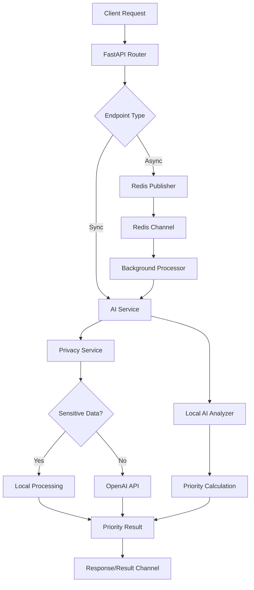

# 📁 Project Structure

```
AIPrioritization/
├── 📄 README.md                    # Main project documentation
├── 📄 IMPLEMENTATION_SUMMARY.md    # Implementation details and achievements
├── 📄 requirements.txt             # Python dependencies
├── 📄 .env.example                 # Environment configuration template
├── 📄 docker-compose.yml           # Docker services configuration
├── 📄 Dockerfile                   # Container build instructions
├── 📄 main.py                      # FastAPI application entry point
├── 📄 models.py                    # Pydantic data models
├── 📄 utils.py                     # Utility functions
├── 📄 config.py                    # Legacy configuration (deprecated)
│
├── 📂 api/                          # API layer
│   ├── 📄 __init__.py
│   ├── 📄 endpoints.py             # Legacy endpoints (deprecated)
│   └── 📂 v1/                      # API version 1
│       ├── 📄 __init__.py
│       ├── 📄 prioritization.py   # Priority management endpoints
│       ├── 📄 health.py           # Health check and monitoring
│       └── 📄 config.py           # Configuration endpoints
│
├── 📂 core/                        # Core application logic
│   ├── 📄 __init__.py
│   └── 📄 config.py               # Centralized configuration management
│
├── 📂 services/                    # Business logic services
│   ├── 📄 __init__.py
│   ├── 📄 ai_service.py           # Main AI prioritization logic
│   ├── 📄 ai_service_new.py       # Alternative AI implementation
│   ├── 📄 local_ai_analyzer.py    # Local AI analysis (GDPR-compliant)
│   ├── 📄 privacy_service.py      # Privacy and sensitive data handling
│   └── 📄 redis_service.py        # Redis pub/sub messaging
│
├── 📂 scripts/                     # Utility and deployment scripts
│   ├── 📄 start.sh                # Application startup script
│   └── 📄 demo.py                 # Demo and example usage
│
├── 📂 tests/                       # Test suites
│   ├── 📄 test_scenarios.py       # Comprehensive test scenarios
│   ├── 📄 test_dynamic_metrics.py # Dynamic metric calculation tests
│   └── 📄 test_client.py          # API client tests
│
├── 📂 docs/                        # Documentation
│   ├── 📄 API.md                  # Comprehensive API documentation
│   ├── 📄 NATS.md                 # NATS integration guide
│   └── 📄 PROJECT_STRUCTURE.md    # This file
│
├── 📂 .github/                     # GitHub-specific files
│   └── 📂 workflows/              # CI/CD workflows
│
├── 📂 .vscode/                     # VS Code configuration
│
└── 📂 __pycache__/                 # Python bytecode cache
```

## 📋 Component Descriptions

### 🎯 Core Application Files

| File | Purpose | Key Features |
|------|---------|--------------|
| `main.py` | FastAPI application entry point | Enhanced Swagger docs, CORS, API versioning |
| `models.py` | Pydantic data models | TaskRequest, AIPriorityResult, validation |
| `requirements.txt` | Python dependencies | Production + dev/test dependencies |

### 🌐 API Layer (`api/`)

| Component | Purpose | Endpoints |
|-----------|---------|-----------|
| `v1/prioritization.py` | Task prioritization API | POST /, POST /sync, GET /status/{id} |
| `v1/health.py` | System monitoring | GET /, GET /detailed, GET /metrics |
| `v1/config.py` | Configuration API | GET /categories, GET /roles, GET /priority-model |

### ⚙️ Core Logic (`core/`)

| Component | Purpose | Features |
|-----------|---------|----------|
| `config.py` | Configuration management | Environment variables, settings validation |

### 🧠 Services (`services/`)

| Service | Purpose | Key Features |
|---------|---------|--------------|
| `ai_service.py` | Main AI prioritization | Auto-metric calculation, AI suggestions |
| `local_ai_analyzer.py` | Local AI processing | GDPR-compliant, no external AI calls |
| `privacy_service.py` | Data privacy handling | PII detection, local processing |
| `redis_service.py` | Messaging service | Pub/sub, async communication |

### 🧪 Testing (`tests/`)

| Test File | Purpose | Coverage |
|-----------|---------|----------|
| `test_scenarios.py` | End-to-end scenarios | Real-world task prioritization |
| `test_dynamic_metrics.py` | Metric calculation | Auto-calculation validation |
| `test_client.py` | API testing | HTTP endpoints, error handling |

### 📚 Documentation (`docs/`)

| Document | Purpose | Content |
|----------|---------|---------|
| `API.md` | API documentation | Endpoints, examples, integration |
| `NATS.md` | NATS integration | Messaging alternatives, migration |
| `PROJECT_STRUCTURE.md` | Project overview | This file |

### 🛠️ Scripts (`scripts/`)

| Script | Purpose | Usage |
|--------|---------|-------|
| `start.sh` | Application startup | `./scripts/start.sh` |
| `demo.py` | Demo and examples | `python scripts/demo.py` |

## 🔄 Data Flow



## 🏗️ Architecture Patterns

### 1. **Layered Architecture**
- **API Layer**: FastAPI routers and endpoints
- **Service Layer**: Business logic and AI processing
- **Data Layer**: Models and validation

### 2. **Microservice Ready**
- **Independent Services**: Each service can be deployed separately
- **Message-Driven**: Async communication via Redis/NATS
- **Health Checks**: Comprehensive monitoring endpoints

### 3. **Event-Driven Design**
- **Pub/Sub Messaging**: Decoupled communication
- **Background Processing**: Non-blocking task handling
- **Real-time Updates**: Live priority calculations

## 🔧 Configuration Management

### Environment-Based Configuration
```
.env.example          → Development template
.env                  → Local development (not in git)
docker-compose.yml    → Container configuration
core/config.py        → Centralized settings
```

### API Versioning Strategy
```
/api/v1/              → Current stable API
/api/v2/              → Future API version (when needed)
Legacy endpoints      → Deprecated but maintained
```

## 📈 Scalability Considerations

### Horizontal Scaling
- **Stateless Services**: All services are stateless
- **Load Balancing**: FastAPI supports multiple workers
- **Message Queues**: Redis/NATS for distributed processing

### Performance Optimization
- **Async/Await**: Non-blocking I/O operations
- **Connection Pooling**: Efficient resource usage
- **Caching**: Redis for temporary data storage

## 🔒 Security Architecture

### Data Protection
- **PII Detection**: `privacy_service.py` handles sensitive data
- **Local Processing**: GDPR-compliant data handling
- **Environment Variables**: Secrets management

### API Security
- **Input Validation**: Pydantic models ensure data integrity
- **CORS Configuration**: Controlled cross-origin access
- **Rate Limiting**: Protection against abuse

## 🚀 Deployment Structure

### Development
```bash
python main.py                    # Direct execution
uvicorn main:app --reload         # Development server
```

### Production
```bash
docker-compose up -d              # Container deployment
kubernetes apply -f k8s/          # Kubernetes deployment
```

## 📊 Monitoring and Observability

### Health Checks
- **Basic Health**: `/api/v1/health/`
- **Detailed Metrics**: `/api/v1/health/detailed`
- **System Metrics**: `/api/v1/health/metrics`

### Documentation
- **Interactive API Docs**: `/docs`
- **Alternative Docs**: `/redoc`
- **OpenAPI Spec**: `/openapi.json`

## 🎯 Future Enhancements

### Planned Improvements
1. **NATS Integration**: Enhanced messaging with JetStream
2. **Database Layer**: Persistent storage for history/analytics
3. **WebSocket Support**: Real-time priority updates
4. **Metrics Collection**: Prometheus/Grafana integration
5. **Authentication**: JWT/OAuth2 implementation

### Modular Extensions
- **Plugin System**: Custom priority calculators
- **Multi-Model AI**: Support for different AI providers
- **Workflow Engine**: Complex prioritization workflows
- **Analytics Dashboard**: Priority trends and insights

---

This structure supports enterprise-grade scalability while maintaining development simplicity and clear separation of concerns.
