# PrioritiAI Workflow Architecture

## System Architecture Diagram

```mermaid
graph TB
    subgraph "External Sources"
        A1[📧 Outlook Email]
        A2[📱 Teams Message]
        A3[🔗 API Request]
    end
    
    subgraph "n8n Workflow Engine - http://31.97.38.31:5678"
        B1[Outlook Trigger<br/>Poll: Every minute]
        B2[Teams Trigger<br/>Webhook-based]
        B3[Webhook Node<br/>/webhook/prioai-tasks]
        
        C[Normalize Input Data<br/>JavaScript Code]
        D[Build AI Payload<br/>JavaScript Code]
        E[HTTP Request<br/>POST /api/v1/prioritization/sync]
        F{IF Is Task?<br/>urgency_level exists?}
        G[Insert Task<br/>PostgreSQL]
        H1[Notify Teams<br/>Adaptive Card]
        H2[Create Planner Task<br/>Optional]
    end
    
    subgraph "AI Service - http://ai-prioritization:8000"
        I1[FastAPI Endpoint]
        I2[OpenAI GPT-4]
        I3[Priority Calculation]
        I4[Response Builder]
    end
    
    subgraph "Database - postgres:5432"
        J[(prioai_db<br/>tasks table)]
    end
    
    subgraph "Notifications"
        K1[📬 Teams Channel]
        K2[📋 Microsoft Planner]
    end
    
    A1 --> B1
    A2 --> B2
    A3 --> B3
    
    B1 --> C
    B2 --> C
    B3 --> C
    
    C --> D
    D --> E
    
    E --> I1
    I1 --> I2
    I2 --> I3
    I3 --> I4
    I4 --> E
    
    E --> F
    F -->|Yes| G
    F -->|No| L[End - Not a Task]
    
    G --> J
    G --> H1
    G --> H2
    
    H1 --> K1
    H2 --> K2
    
    style A1 fill:#e1f5ff
    style A2 fill:#e1f5ff
    style A3 fill:#e1f5ff
    style E fill:#fff4e6
    style I1 fill:#f3e5f5
    style I2 fill:#f3e5f5
    style G fill:#e8f5e9
    style J fill:#e8f5e9
```



## Data Flow Diagram


## Field Mapping Flow

```mermaid
graph LR
    subgraph "Input (Outlook/Teams/Webhook)"
        I1[subject/title]
        I2[body/content]
        I3[sender/from]
        I4[id/messageId]
    end
    
    subgraph "Normalized Format"
        N1[title]
        N2[content]
        N3[sender]
        N4[source_ref]
        N5[source: outlook/teams/manual]
    end
    
    subgraph "AI Request (TaskRequest)"
        A1[id: task_timestamp_random]
        A2[title]
        A3[description]
        A4[category: SUPPORT]
        A5[requester_role: EMPLOYEE/MANAGER]
        A6[requester_name]
    end
    
    subgraph "AI Response (AIPriorityResult)"
        R1[request_id]
        R2[urgency_level: CRITICAL/HIGH/MEDIUM/LOW]
        R3[priority_metrics.final_priority_score: 0-10]
        R4[reasoning]
        R5[suggested_sla_hours]
        R6[priority_metrics.effort_complexity_score]
    end
    
    subgraph "Database (tasks table)"
        D1[title ← request_id]
        D2[description ← content]
        D3[priority_score ← final_priority_score]
        D4[urgency_level]
        D5[reasoning]
        D6[due_at ← NOW + sla_hours]
        D7[est_minutes ← effort_score * 60]
    end
    
    I1 --> N1
    I2 --> N2
    I3 --> N3
    I4 --> N4
    
    N1 --> A2
    N2 --> A3
    N3 --> A6
    
    A2 --> R1
    A3 --> R1
    
    R1 --> D1
    N2 --> D2
    R3 --> D3
    R2 --> D4
    R4 --> D5
    R5 --> D6
    R6 --> D7
    
    style I1 fill:#e3f2fd
    style I2 fill:#e3f2fd
    style I3 fill:#e3f2fd
    style I4 fill:#e3f2fd
    
    style N1 fill:#fff3e0
    style N2 fill:#fff3e0
    style N3 fill:#fff3e0
    style N4 fill:#fff3e0
    style N5 fill:#fff3e0
    
    style A1 fill:#f3e5f5
    style A2 fill:#f3e5f5
    style A3 fill:#f3e5f5
    style A4 fill:#f3e5f5
    style A5 fill:#f3e5f5
    style A6 fill:#f3e5f5
    
    style R1 fill:#e8f5e9
    style R2 fill:#e8f5e9
    style R3 fill:#e8f5e9
    style R4 fill:#e8f5e9
    style R5 fill:#e8f5e9
    style R6 fill:#e8f5e9
    
    style D1 fill:#fce4ec
    style D2 fill:#fce4ec
    style D3 fill:#fce4ec
    style D4 fill:#fce4ec
    style D5 fill:#fce4ec
    style D6 fill:#fce4ec
    style D7 fill:#fce4ec
```



## Priority Calculation Logic

```mermaid
graph TD
    A[📥 Task Input] --> B[🤖 OpenAI GPT-4 Analysis]
    
    B --> C1[Business Impact Score<br/>0-10 scale]
    B --> C2[Risk Score<br/>0-10 scale]
    B --> C3[Urgency Score<br/>0-10 scale]
    B --> C4[Time Sensitivity<br/>0-10 scale]
    B --> C5[Effort Complexity<br/>0-10 scale]
    B --> C6[Role Weight<br/>0-5 scale]
    
    C1 --> D{Weighted<br/>Calculation}
    C2 --> D
    C3 --> D
    C4 --> D
    C5 --> D
    C6 --> D
    
    D --> E[Final Priority Score<br/>0-10 scale]
    
    E --> F{Urgency<br/>Classification}
    
    F -->|Score ≥ 8.0| G1[🔴 CRITICAL<br/>SLA: 2-4 hours]
    F -->|Score ≥ 6.0| G2[🟠 HIGH<br/>SLA: 8-12 hours]
    F -->|Score ≥ 4.0| G3[🟡 MEDIUM<br/>SLA: 24-48 hours]
    F -->|Score < 4.0| G4[🟢 LOW<br/>SLA: 72+ hours]
    
    G1 --> H[📊 Complete Priority Result]
    G2 --> H
    G3 --> H
    G4 --> H
    
    H --> I[💾 Store in Database]
    H --> J[📬 Send Notifications]
    
    style B fill:#e1bee7
    style D fill:#fff9c4
    style E fill:#c8e6c9
    style G1 fill:#ffcdd2
    style G2 fill:#ffe0b2
    style G3 fill:#fff9c4
    style G4 fill:#c8e6c9
```



## Deployment Architecture

```mermaid
graph TB
    subgraph "Hostinger VPS - 31.97.38.31"
        subgraph "Docker Network: prioai_network"
            A[prioai-n8n<br/>Port 5678<br/>HTTP]
            B[prioai-ai-service<br/>Port 8000<br/>HTTP]
            C[prioai-postgres<br/>Port 5432<br/>localhost only]
        end
        
        D[UFW Firewall<br/>Allow: 22, 5678, 8000]
    end
    
    subgraph "External Services"
        E1[Microsoft 365<br/>Outlook + Teams]
        E2[OpenAI API<br/>GPT-4]
        E3[GitHub Actions<br/>CI/CD]
    end
    
    subgraph "Users"
        U1[👤 Admin<br/>n8n UI]
        U2[👥 Team<br/>Outlook/Teams]
        U3[🔧 Frontend<br/>API Calls]
    end
    
    D --> A
    D --> B
    
    A <-->|OAuth| E1
    A <-->|Internal Docker| B
    A <-->|Internal Docker| C
    B <-->|API Key| E2
    
    U1 -->|HTTP 5678| A
    U2 -->|Email/Message| E1
    U3 -->|HTTP 5678<br/>Webhook| A
    
    E3 -->|SSH Deploy| D
    
    style A fill:#bbdefb
    style B fill:#c5cae9
    style C fill:#c8e6c9
    style D fill:#ffccbc
    style E1 fill:#f8bbd0
    style E2 fill:#f8bbd0
    style E3 fill:#f8bbd0
```



## Credential Configuration


## Testing Flow


---

## Quick Commands Reference

### Health Checks
```bash
# AI Service
curl http://31.97.38.31:8000/health

# n8n
curl http://31.97.38.31:5678/healthz

# PostgreSQL
ssh root@31.97.38.31 "docker exec prioai-postgres pg_isready -U prioai_user"
```

### Test AI Service
```bash
curl -X POST http://31.97.38.31:8000/api/v1/prioritization/sync \
  -H "Content-Type: application/json" \
  -d '{
    "id": "test-123",
    "title": "Test task",
    "description": "Server down",
    "category": "INFRASTRUCTURE",
    "requester_role": "IT_ADMIN",
    "requester_name": "Test User",
    "created_at": "2025-10-06T12:00:00Z"
  }'
```

### Test Webhook (workflow must be active)
```bash
curl -X POST http://31.97.38.31:5678/webhook/prioai-tasks \
  -H "Content-Type: application/json" \
  -d '{
    "title": "Webhook test",
    "description": "Testing integration",
    "requester": "test@company.com"
  }'
```

### Run Automated Test Script
```bash
./infra/deploy/test-deployment.sh
```
